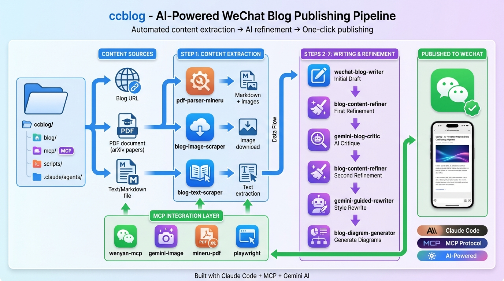
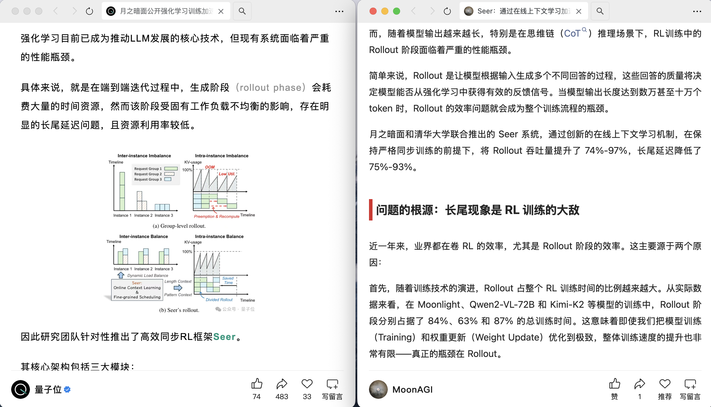

# ccblog - 通过 Claude Code 自动发布博客到微信公众号

使用 wenyan-mcp 服务，通过 Claude Code 自动读取本地 Markdown 文件并发布到微信公众号。

## 系统架构



ccblog 是一个完整的 AI 驱动博客生产与发布流程，从内容抓取到微信公众号发布一键完成。

## 为什么这是顶级微信公众号自动生成 Pipeline？

### 质量碾压传统科技媒体

作为一个经常阅读技术文章的读者，我发现国内主流科技媒体（量子位、机器之心、新智元）的 AI 生成内容质量堪忧。**它们的文章一看就是低成本 AI 批量生成的拼好饭**——要么只是简单翻译原文，要么堆砌专业术语却无法让普通读者理解核心思想。

**对比示例：** 我最近发现量子位和我都解读了同一篇论文。看完他们的版本，我依然云里雾里，不知所云；而通过我的 pipeline 生成的版本，循序渐进、图文并茂，即使是非专业读者也能真正理解论文的核心创新点。


这不是偶然——**这是系统性的质量差距**。

### 三大核心优势

#### 1. 严密且持续优化的多 Agent Pipeline

我开发的 pipeline 不是简单的 "PDF → AI → 发布"，而是一个**经过多轮迭代优化的复杂系统**：

- **PDF 解析 Agent**（pdf-parser-mineru）: 使用 MinerU 精确提取论文结构、图表、公式
- **文本抓取 Agent**（blog-text-scraper）: 智能抓取网络文章，保留完整上下文
- **图片抓取 Agent**（blog-image-scraper）: 批量下载并本地化所有图片资源
- **博客写作 Agent**（wechat-blog-writer）: 将原始内容转化为通俗易懂的叙事
- **Gemini 评审 Agent**（gemini-blog-critic）: 对标原文进行深度批判性审查
- **内容优化 Agent**（blog-content-refiner）: 识别晦涩段落，插入解释性内容
- **Gemini 引导重写 Agent**（gemini-guided-rewriter）: 基于 AI 生成的理想解读框架重构文章
- **图表生成 Agent**（blog-diagram-generator）: 自动生成框架图辅助理解

每个 Agent 都有明确分工，**多次交叉验证和优化**，确保最终输出的文章既忠实原文，又真正可读。

#### 2. 调用世界上最强的模型

那些传统媒体为了降低成本，使用廉价的 AI 模型批量生成内容。**我直接调用 Claude Sonnet 4.5 和 Gemini 3 Pro Thinking**——这是目前公开可用的最强 LLM 之一。

- **更深的理解力**: Claude 能够准确把握论文的技术细节和创新点
- **更好的表达力**: 生成的内容既专业又通俗，避免生硬翻译
- **更高的 API 成本**: 是的，我在每篇文章上的 API 开销远超那些媒体，但这保证了质量

**我花的 API 费用比量子位多得多，但这是值得的。**

#### 3. 精心选材 + 真实兴趣驱动

我的公众号不是批量生产线，每一篇文章的选材都基于：
- **我自己真正感兴趣的研究方向**（比如最近的 VLA、Agent 等）
- **业界大佬推荐的经典论文**
- **实际需求驱动**（比如我想深入理解某个技术时，就让 pipeline 给我讲解）

这种选材机制确保了**内容的价值密度远超那些追热点的媒体**。

### 实际使用体验：我已经上瘾了

自从这个 pipeline 打磨成熟后，我现在**没事就想找几篇论文让它给我讲讲**。比如最近：

1. 我挑选了 6 篇 VLA（Vision-Language-Action）领域的经典论文
2. 让 Gemini 推荐其中的关键文献
3. 启动 6 个并行 Agent 自动生成深度解读
4. 几小时后，我就能发布一套完整的系列解读

**这种体验是传统媒体无法提供的**——既有专业深度，又有个性化筛选，还有图文并茂的呈现。

### 技术细节决定成败

为什么我的 pipeline 能做到这么高的质量？关键在于**多层次的 refinement**：

1. **第一轮**: 基础内容生成
2. **第二轮**: Gemini Critic 对比原文进行批判性审查，识别误解、遗漏和不清晰的地方
3. **第三轮**: Blog Content Refiner 针对性地优化晦涩段落
4. **第四轮**: Gemini Guided Rewriter 基于理想解读框架重构整体叙事
5. **第五轮**: Blog Diagram Generator 生成补充说明图表

**每一轮都在提升质量，而那些传统媒体只有第一轮。**

## 工作原理

```
本地 MD 文件 → Claude Code (MCP Client) → wenyan-mcp (MCP Server) → 微信公众号
```

## 快速开始

### 1. 编译 wenyan-mcp（已完成 ✅）

```bash
cd mcp/wenyan-mcp
npm install
npx tsc -b
```

### 2. 配置 Claude Code MCP

使用 `claude mcp add` 命令添加 MCP 服务：

```bash
# 添加微信公众号发布 MCP
claude mcp add --transport stdio \
  -e WECHAT_APP_ID=你的微信公众号AppID \
  -e WECHAT_APP_SECRET=你的微信公众号AppSecret \
  -- wenyan-mcp node /Users/limo/Documents/GithubRepo/ccblog/mcp/wenyan-mcp/dist/index.js

# 添加 Gemini 图片生成 MCP（可选）
claude mcp add --transport stdio \
  -e OPENAI_API_KEY=你的千循API密钥 \
  -e OPENAI_BASE_URL=your-openai-compatible-api-url \
  -- gemini-image node /Users/limo/Documents/GithubRepo/ccblog/mcp/gemini-image-mcp/dist/index.js

# 添加 Playwright MCP（可选，用于网页自动化）
claude mcp add --transport stdio \
  -- playwright npx -y @playwright/mcp@latest --headless --isolated --viewport-size 3840x2160

# 添加 MinerU PDF 解析 MCP（可选，用于 PDF 转 Markdown）
claude mcp add --transport stdio \
  -- mineru-pdf /Users/limo/Documents/GithubRepo/ccblog/.venv/bin/python /Users/limo/Documents/GithubRepo/ccblog/mcp/mineru-pdf-mcp/server.py
```

**注意：** 请将命令中的路径替换为你本地的实际路径。

**管理 MCP 服务：**
```bash
# 查看所有 MCP 服务状态
claude mcp list

# 删除某个 MCP 服务
claude mcp remove server-name
```

### 获取微信公众号认证信息

1. 登录微信公众平台：https://mp.weixin.qq.com
2. 进入「设置与开发」→「基本配置」
3. 获取开发者ID(AppID) 和 开发者密码(AppSecret)
4. 配置 IP 白名单（必须！）

详细配置说明：https://yuzhi.tech/docs/wenyan/upload

### 3. 验证 MCP 服务

配置完成后，使用以下命令验证 MCP 服务是否正常：

```bash
claude mcp list
```

你应该看到类似这样的输出：
```
✓ wenyan-mcp: Connected
✓ gemini-image: Connected
```

### 4. 使用 Claude Code 发布文章

现在你可以直接在 Claude Code 中这样操作：

```
帮我把 blog_pydantic_model.md 这个文件发布到微信公众号，使用 rainbow 主题
```

Claude Code 会：
1. 读取你的 MD 文件
2. 调用 wenyan-mcp 进行排版
3. 自动上传图片
4. 发布到公众号草稿箱

## Markdown 文件格式要求

在你的 MD 文件开头添加 frontmatter：

```markdown
---
title: 文章标题
cover: /path/to/cover/image.jpg
---

你的文章内容...
```

- `title`: 必填，文章标题
- `cover`: 可选，封面图（本地路径或网络 URL）
  - 如果正文有图片可省略
  - 无图片时必须提供

## 可用主题

wenyan-mcp 提供 8 种精美主题：

- `default` - 默认主题
- `orangeheart` - Orange Heart（橙心）
- `rainbow` - Rainbow（彩虹）
- `lapis` - Lapis（青金石）
- `pie` - Pie（派）
- `maize` - Maize（玉米）
- `purple` - Purple（紫色）
- `phycat` - 物理猫-薄荷

主题预览：https://yuzhi.tech/docs/wenyan/theme

## 示例文章

本仓库包含一个示例文章：`blog_pydantic_model.md`

你可以直接在 Claude Code 中说：

```
帮我看看 blog_pydantic_model.md 文件，然后发布到微信公众号
```

## MCP 提供的工具

wenyan-mcp 提供了两个工具：

1. **`list_themes`** - 列出所有可用主题
   ```
   列出公众号发布的所有可用主题
   ```

2. **`publish_article`** - 发布文章到公众号
   - 参数：
     - `content`: Markdown 内容（包含 frontmatter）
     - `theme_id`: 主题 ID（可选，默认 default）

## 使用示例

### 简单发布
```
帮我把 my_article.md 发布到公众号
```

Claude Code 会：
1. 读取你的 MD 文件
2. 调用 wenyan-mcp 进行排版
3. 自动上传图片
4. 发布到公众号草稿箱

### 指定主题发布
```
把 blog_pydantic_model.md 用 rainbow 主题发布到公众号
```

### 查看可用主题
```
公众号助手有哪些主题可以用？
```

### 批量发布
```
帮我把 posts 目录下所有 .md 文件都发布到公众号，使用 lapis 主题
```

### 修改后重新发布
```
帮我修改 article.md 的标题，然后重新发布到公众号
```

## 图片处理

支持以下图片路径：

1. **本地绝对路径**：`/Users/limo/Pictures/image.jpg`
2. **本地相对路径**：`./images/photo.png`
3. **网络 URL**：`https://example.com/image.jpg`

所有图片会自动上传到微信公众号素材库。

## 环境变量配置

### MCP 输出限制

**建议：** 将以下环境变量添加到你的 `~/.zshrc` 或 `~/.bashrc` 文件中，以提高 MCP 工具的输出限制：

```bash
# 增加 MCP 工具响应的最大 token 数量（默认 25000）
export MAX_MCP_OUTPUT_TOKENS=100000
```

配置后需要重新加载配置文件：
```bash
source ~/.zshrc  # 或 source ~/.bashrc
```

这对于处理大型文件或复杂输出特别有用。

## 故障排除

### MCP 服务未连接

1. 检查配置文件路径是否正确
2. 确认 wenyan-mcp 已编译（存在 `mcp/wenyan-mcp/dist/index.js`）
3. 重启 Claude Code

### 发布失败

常见原因：

1. **IP 白名单未配置**（最常见！）
   - 登录微信公众平台：https://mp.weixin.qq.com
   - 进入「设置与开发」→「基本配置」→「IP白名单」
   - 添加你的服务器/本机 IP 地址
   - 查看本机公网 IP：`curl ifconfig.me`
   - 详细说明：https://yuzhi.tech/docs/wenyan/upload

2. **认证错误**：检查 App ID 和 App Secret 是否正确

3. **frontmatter 格式错误**：检查 YAML 格式是否正确

4. **图片路径错误**：确认文件存在且路径正确

### 查看 MCP 日志

在 Claude Code 对话中，MCP 的错误信息会直接显示。

## 高级配置

### 使用 Docker 运行 MCP

如果你想在服务器上运行 wenyan-mcp，可以使用 Docker：

```json
{
  "mcpServers": {
    "wenyan-mcp": {
      "name": "公众号助手",
      "command": "docker",
      "args": [
        "run",
        "--rm",
        "-i",
        "-v", "/Users/limo/Pictures:/mnt/host-downloads",
        "-e", "WECHAT_APP_ID=your_app_id",
        "-e", "WECHAT_APP_SECRET=your_app_secret",
        "-e", "HOST_IMAGE_PATH=/Users/limo/Pictures",
        "caol64/wenyan-mcp"
      ]
    }
  }
}
```

### 全局安装 wenyan-mcp

如果你想在任何地方使用：

```bash
npm install -g @wenyan-md/mcp
```

然后配置文件简化为：

```json
{
  "mcpServers": {
    "wenyan-mcp": {
      "name": "公众号助手",
      "command": "wenyan-mcp",
      "env": {
        "WECHAT_APP_ID": "your_app_id",
        "WECHAT_APP_SECRET": "your_app_secret"
      }
    }
  }
}
```

## PDF 解析工具（MinerU）

### 功能特性

MinerU 是一个本地运行的 PDF 解析工具，可以：
- ✅ **完全本地运行**，无需 API Key
- ✅ **PDF 转 Markdown**，保留格式和结构
- ✅ **自动提取图片**，保存为独立文件
- ✅ **支持公式识别**（LaTeX 格式）
- ✅ **表格提取**，转换为 Markdown 表格
- ✅ **多语言 OCR**（中文、英文、日语等）

### 使用方法

#### 方式一：直接使用命令行

```bash
# 激活环境
cd /Users/limo/Documents/GithubRepo/ccblog
source .venv/bin/activate

# 首次使用：下载模型（约 2-3GB，只需一次）
python -m mineru.cli.models_download

# 解析单个 PDF
python -m mineru.cli.client -p /path/to/paper.pdf -o ./output -l en

# 使用便捷脚本
./mcp/mineru-pdf-mcp/parse_pdf.sh /path/to/paper.pdf ./output
```

#### 方式二：通过 Claude Code MCP（推荐）

配置好 MCP 后，直接在 Claude Code 中说：

```
帮我解析这个 PDF 为 Markdown：/path/to/document.pdf
```

或

```
使用 parse_pdf 工具解析这个论文，输出到 ./output 目录
```

Claude Code 会自动调用 MinerU 本地解析，无需任何 API Key。

### 输出结果

解析后会生成：

```
output/
└── paper/
    ├── paper.md              # 最终的 Markdown 文件
    ├── images/               # 提取的所有图片
    │   ├── image_001.png
    │   ├── image_002.png
    │   └── ...
    └── auto/                 # 中间处理文件
        ├── content_list.json
        ├── middle.json
        └── model.json
```

### 常用参数

```bash
# 启用 OCR（扫描版 PDF）
python -m mineru.cli.client -p scan.pdf -o ./output -m ocr

# 指定语言
python -m mineru.cli.client -p paper.pdf -o ./output -l en  # 英文
python -m mineru.cli.client -p paper.pdf -o ./output -l ch  # 中文

# 只处理特定页面
python -m mineru.cli.client -p paper.pdf -o ./output -s 0 -e 10  # 第1-10页

# 批量处理
python -m mineru.cli.client -p ./pdfs_folder -o ./output
```

### 详细文档

更多使用说明和故障排除，请参考：
- [快速开始（中文）](mcp/mineru-pdf-mcp/README_CN.md)
- [本地部署指南](mcp/mineru-pdf-mcp/LOCAL_SETUP.md)

## 项目结构

```
ccblog/
├── blog/                       # 博客文章目录
├── mcp/                        # MCP 服务目录
│   ├── wenyan-mcp/            # 文颜 MCP 服务（微信公众号发布）
│   │   ├── src/               # 源代码
│   │   ├── dist/              # 编译输出
│   │   └── package.json
│   ├── mineru-pdf-mcp/        # MinerU PDF 解析服务
│   │   ├── server.py          # MCP 服务器（完全本地运行）
│   │   ├── parse_pdf.sh       # 便捷解析脚本
│   │   ├── README_CN.md       # 中文快速开始
│   │   └── LOCAL_SETUP.md     # 详细部署指南
│   ├── xiaohongshu-mcp/       # 小红书 MCP 服务
│   └── generate-image-mcp/    # 图片生成 MCP 服务
├── scripts/                    # Python 工具脚本
│   ├── download_arxiv_images.py
│   ├── extract_arxiv_images.py
│   ├── scrape_arxiv_images.py
│   └── scrape_arxiv_playwright.py
└── mcp-config-example.json     # MCP 配置示例
```

## Star History

[](https://www.star-history.com/#mor-li/ccblog&type=date&legend=top-left)

## 相关资源

- [文颜官网](https://yuzhi.tech/wenyan)
- [文颜文档](https://yuzhi.tech/docs/wenyan/theme)
- [wenyan-mcp GitHub](https://github.com/caol64/wenyan-mcp)
- [MinerU GitHub](https://github.com/opendatalab/MinerU)
- [MinerU 官方文档](https://opendatalab.github.io/MinerU/)
- [Claude Code 文档](https://docs.anthropic.com/claude-code)
- [MCP 协议文档](https://modelcontextprotocol.io/)

## License

Apache License Version 2.0

## 致谢

- [文颜 MCP](https://github.com/caol64/wenyan-mcp) - 微信公众号排版工具
- [小红书 MCP](https://github.com/xpzouying/xiaohongshu-mcp) - 小红书发布工具

---

<div align="center">
  
  <p><strong>扫码关注公众号，查看 AI 生成的深度技术解读</strong></p>
</div>
